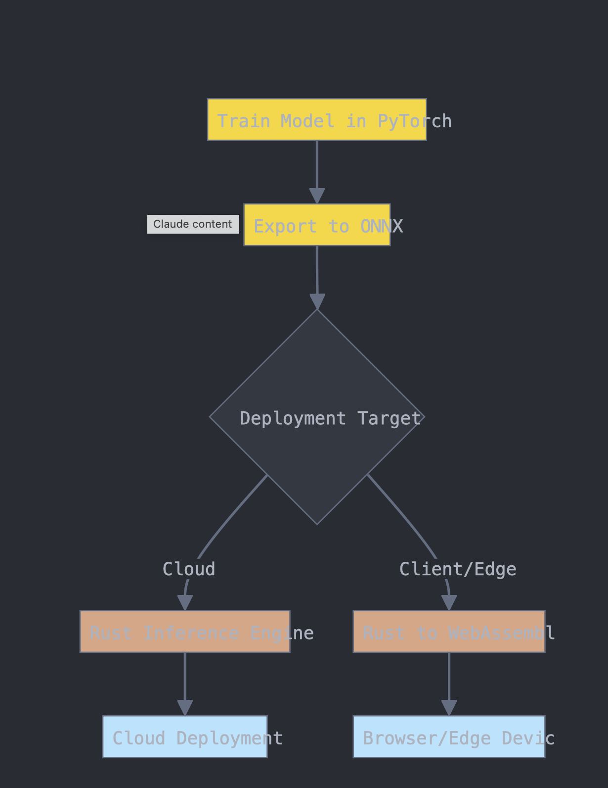

# rust-ml-inference
An overly simple ml inference engine in Rust for small models to save on cloud compute or to run on client in WebAssembly.




Why Use Rust for Inference
---
###### No Garbage Collector overhead + Memory Safety:

**Performance**: Rust's zero-cost abstractions and lack of garbage collection lead to faster execution and lower latency.
**Memory Safety**: Rust's ownership model prevents common bugs like null or dangling pointer dereferences without runtime costs.
**Concurrency**: Rust's fearless concurrency allows for safe and efficient parallel processing, which can be beneficial for batch inference.
**Smaller Binary Size**: Rust typically produces smaller binaries compared to Python, which is advantageous for deployment.


###### Memory Usage in the Cloud:

**Lower Memory Footprint**: Rust-based inference engines typically have a lower memory footprint compared to Python-based ones, allowing you to use smaller (and cheaper) cloud instances.
**Better Memory Management**: Rust's ownership model and lack of garbage collection lead to more predictable memory usage, which is crucial in cloud environments where memory is a key cost factor.
**Efficient Resource Utilization**: Rust's ability to fine-tune memory usage allows for better utilization of cloud resources, potentially allowing you to serve more requests per instance.

###### WebAssembly (Wasm) Conversion for Client-Side Inference:

**Cross-Platform Compatibility**: Wasm runs in all modern browsers, allowing you to deploy your model across different platforms without modification.
**Near-Native Performance**: Wasm execution speed is close to native, providing efficient client-side inference.
Reduced Server Load: By running inference on the client, you can significantly reduce server load and associated costs.
**Enhanced Privacy**: Client-side inference keeps user data on their device, which can be a significant privacy advantage.
**Offline Capabilities**: Once loaded, Wasm modules can run offline, enhancing user experience in poor network conditions.

Training Setup
---
venvs crave to be in the base directory unfortunately
... in the project base
```bash
python3 -m venv .venv
source .venv/bin/activate
pip install -r requirements.txt
```
when you are done w that python interpreter
```bash
deactivate
```
when you pip install something don't forget to
```bash
pip freeze > requirements.txt
```

Inference Setup
---
A replication of the functionality of pytorch but in rust.
For learning purposes of the rust language, pytorch, and building neural networks.
(ML with the builder pattern? 👀)

rust setup in `neural-network` directory
build rust crate
---
build and compile
```bash
cargo build
```

if you just want to install dependencies w no compile
```bash
cargo fetch
```

run lib
```
cargo run
```

testing the WebAssembly
```bash
wasm-pack build --target web
wasm-pack test --chrome
```
or --firefox or --safari
